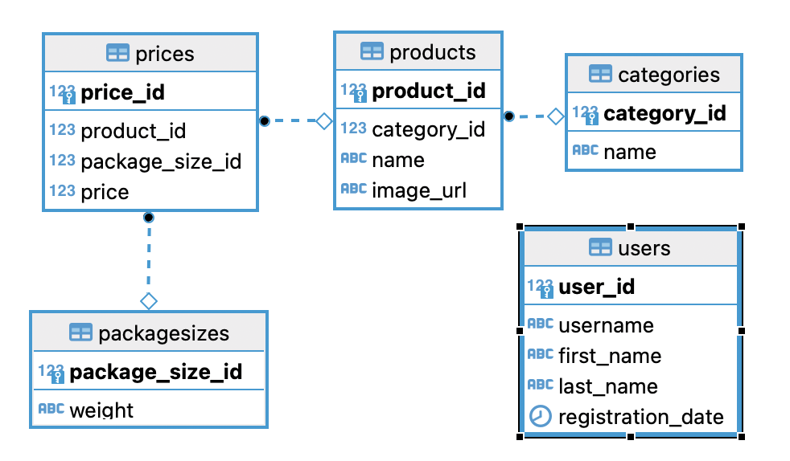
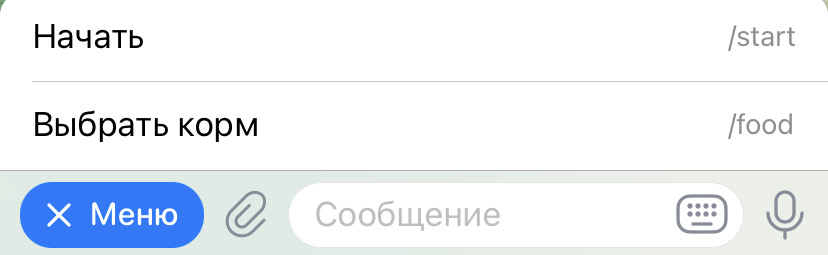
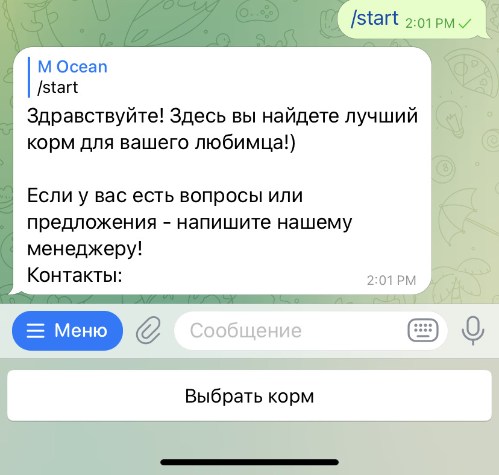
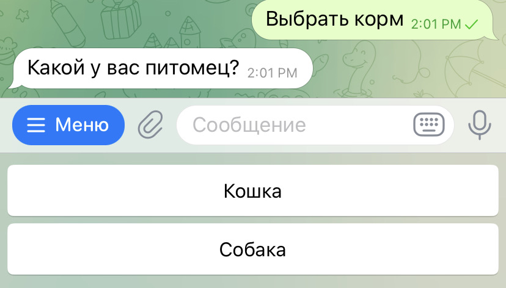
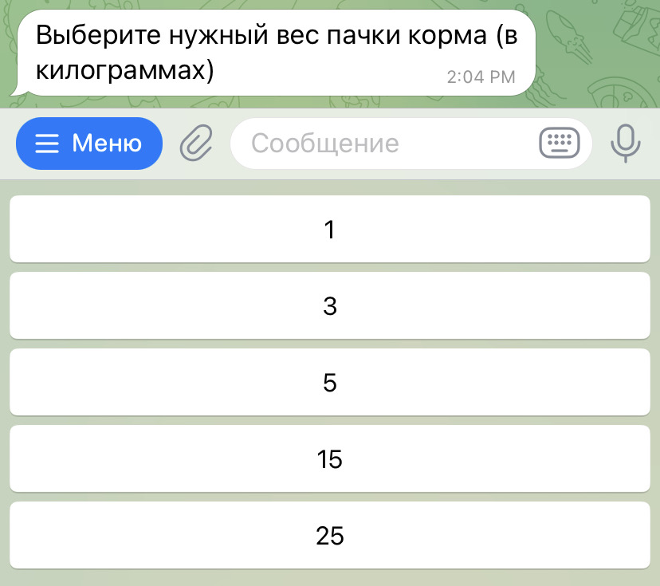

## Телеграм БОТ для подбора корма животным по категории и весу упаквки   Выполнен в рамках тестового задания

---

### Описание

В проекте реализован бот, который возвращает обьекты из БД по запросу пользователя.

Бот работает в связке с БД PostgreSQL которая имеет слудующую структуру:

---

### Установка
    * Клонируйте репозиторий.
    * Создайте локально пустую БД PostgreSQL
    * Установите зависимости:   
        - pip install -r requirements.txt

    * Выполните скрипт создания таблиц и наполните БД командой
        - python db_creater.py
        (скрипт создат необходимые для работы бота таблицы и наполнит их
        минимальным количеством данных для тестирования функицонала бота)

    * Добавьте в корневую папку проекта файл .env и заполните его:
        DB_HOST = 'Хост БД'
        DB_PORT = 'Порт БД'
        DB_LOGIN = 'Пользователь БД'
        DB_PASS = 'Пароль БД'
        DB_NAME = 'Название БД'
        TOKEN = 'Токен вашего бота'
    * Запустите бот командой
        - python bot.py

---

### Использование
### Начало
    - В кнопке "Меню" хранятся основные команды

~~ ~~ ~~ ~~ ~~
### start
    - Выбрав команду /start или нажав кнопку Начать, при первом использовании
    - вы получите ответ с приветствием и контактами менеджера
    - Так же ниже появится кнопка "Выбрать корм" 

~~ ~~ ~~ ~~ ~~
### Выбрать корм /food 
    - После нажатия "Выбрать корм" или команды /food, 
    - Нужно выбрать категорию (Вид животного)

~~ ~~ ~~ ~~ ~~
### Размер упаковки
    - После выбора категории необходимо выбрать размер упаковки

~~ ~~ ~~ ~~ ~~
### Результат
    - После выбора размера пользователь получит информацию о всех доступных товарах в рамках запроса
    - Если подходящих товаров нет - выведется соответсвущее сообщение
    - После получания результата - вы можете запросить новый,
        для этого воспользуйтесь "Меню" и выберите нужную команду

---

### Контакты:

